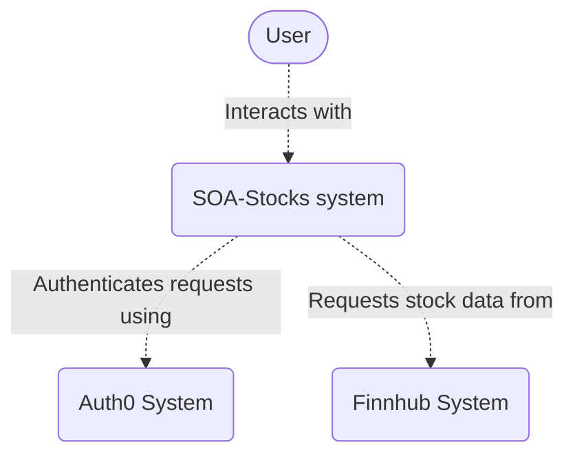
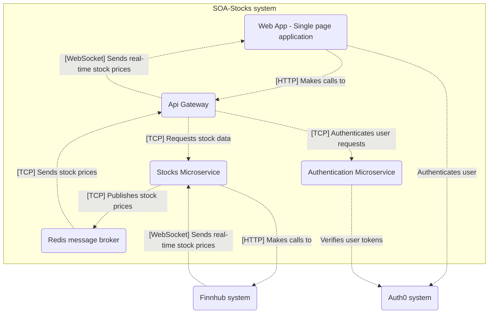
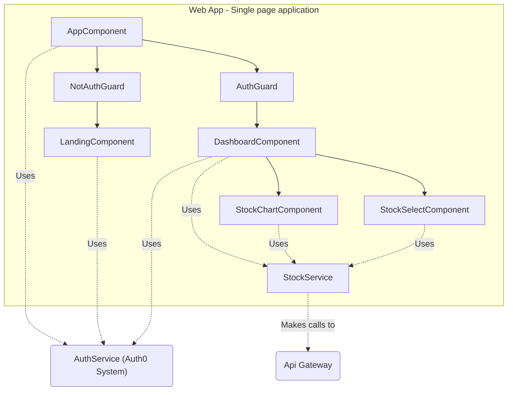
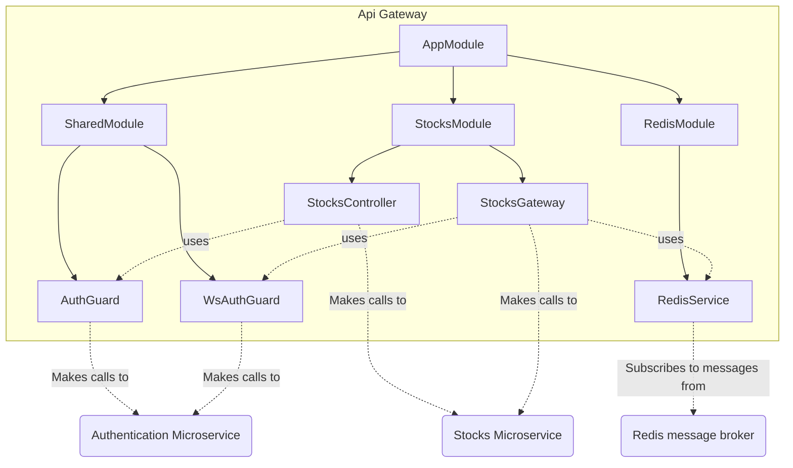
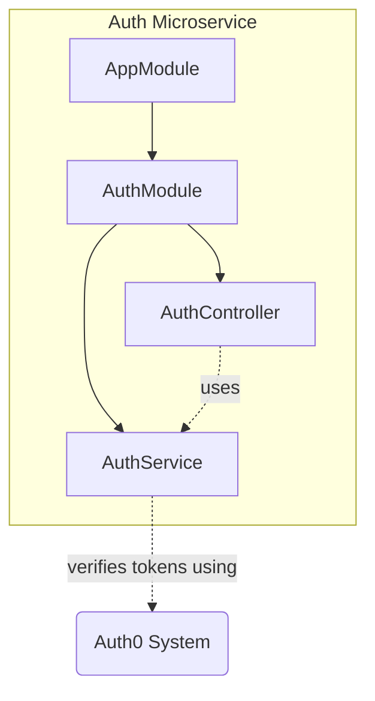
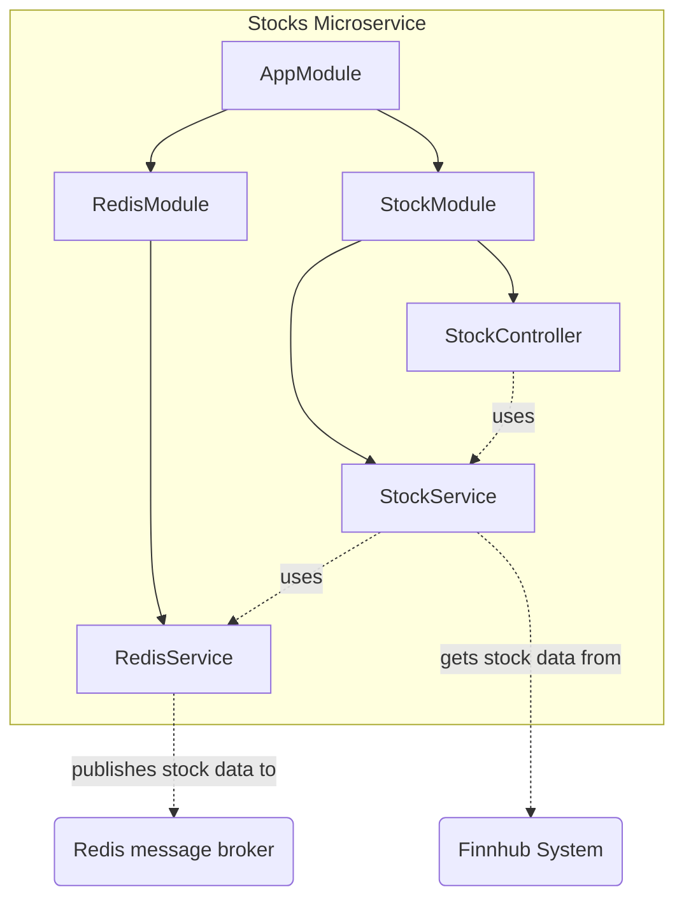
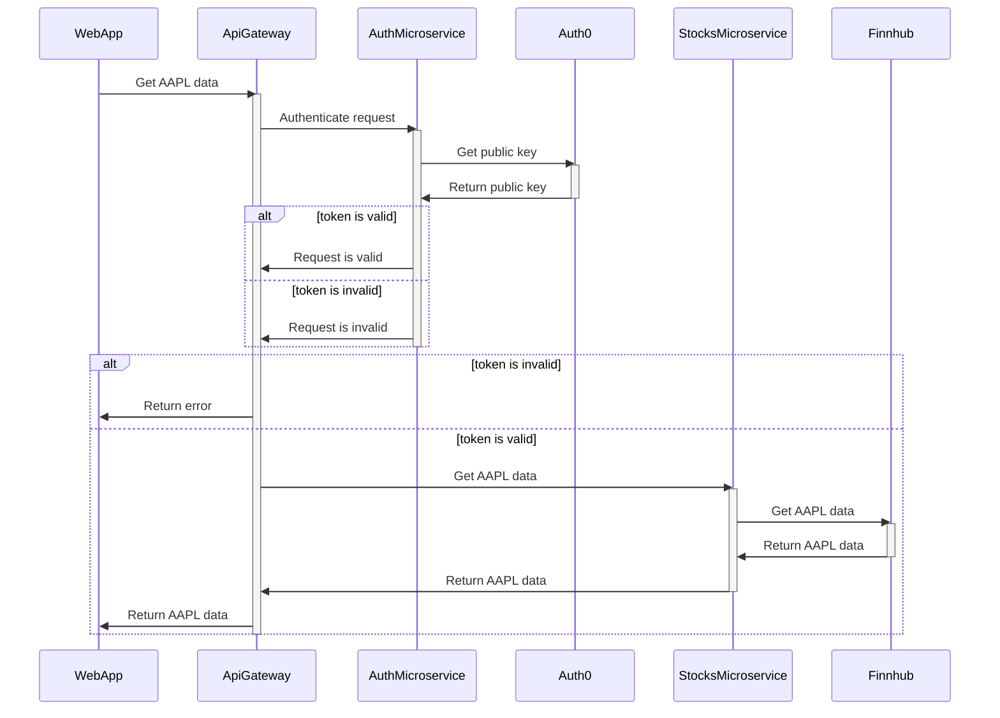

# Stocks app - microservices & docker

University project - Service Oriented Architecture

## System diagram

## Container diagram (of SOA-Stocks system)

## Component diagram (of Web App - Single page application)

## Component diagram (of Api Gateway)

## Component diagram (of Auth Microservice)

## Component diagram (of Stocks Microservice)

## Sequence diagram (of get chart stock data)

## Microservice patterns used

Decomposition:
- **Decompose by business capability** - define services corresponding to business capabilities

Data management:
- **API Composition** - implement queries by invoking the services that own the data and performing an in-memory join

Deployment patterns:
- **Service instance per Container** - deploy each service instance in its container

Communication patterns:
- **Domain-specific protocol** - use a domain-specific protocol
- **Messaging** - use asynchronous messaging for inter-service communication
- **API gateway** - a service that provides each client with unified interface to services

Security:
- **Access Token** - a token that securely stores information about user that is exchanged between services