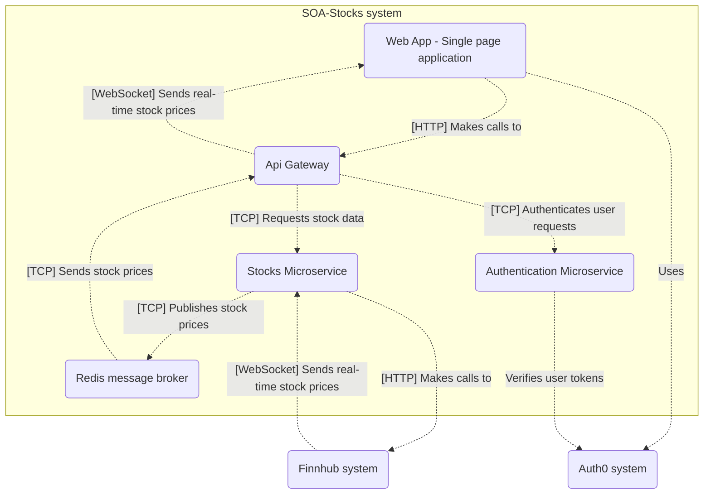
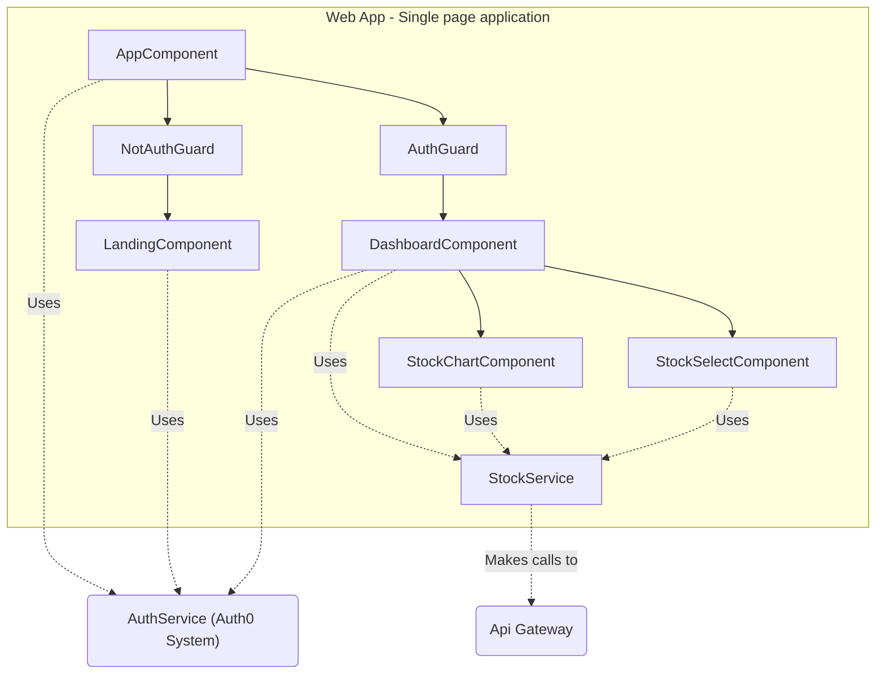

# Stocks app - microservices & docker

University project - Service Oriented Architecture

## System diagram

## Container diagram (of SOA-Stocks system)

## Component diagram (of Web App - Single page application)

## Component diagram (of Api Gateway)

## Component diagram (of Auth Microservice)

## Component diagram (of Stocks Microservice)
